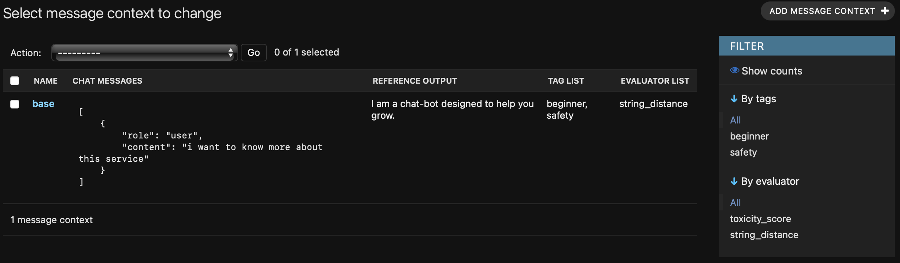
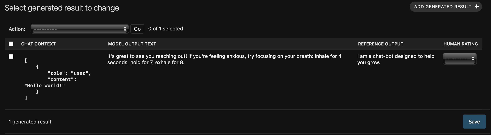
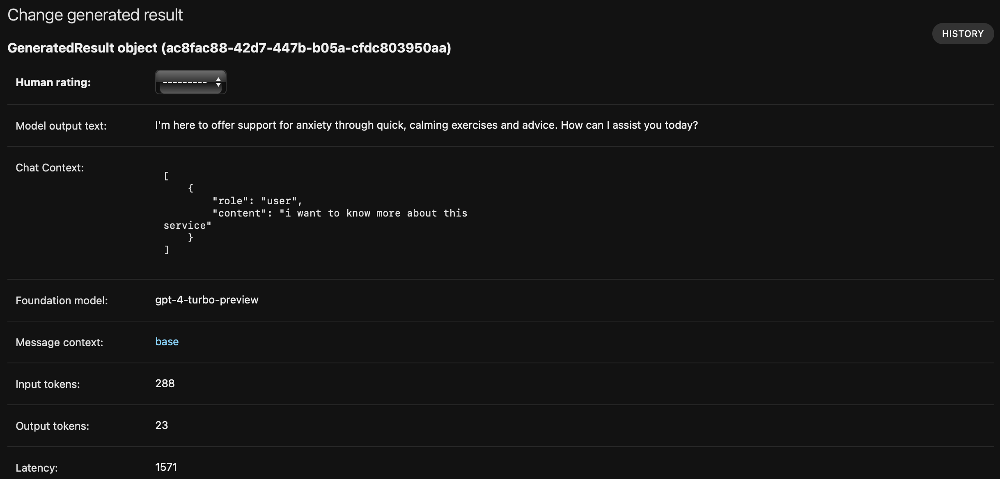

# unchained

A Django-based tool for quickly constructing both prompt and model evaluations systems. 

## Motivation

A lot of focus in Generative AI has been placed on model evaluation, comparing different models against a suit of 
benchmarked prompts. However, the first task when building a new product with an LLM is to build out that golden 
set of prompts to benchmark against. To do this with an experimentation-first approach, we need to iterate across many
different message formats, retrieval augmented systems, examples, and more.  

I created Unchained as an opensource framework that helps organize and orchestrate prompt creation, which can then
be used for both prompt and evaluations. The tool can be used to help first generate a golden set of prompts, and then 
iterate over. Unchained runs on any standard Postgres instance, locally or hosted. The tool supports the following:

- Dynamic construction of system prompts including Augmentation, Examples, Personalization, Instructions, and more
- Both Human and programmatic evaluation based on customizable quantitative metrics
- Compatibility with Messages format, also known as the OpenAI format
- Flexible tagging system for organizing Messages
- Token cost and latency metrics for each evaluation

The tool is built on the Django ecosystmem and leverages pgvector for the vector store. I personally use this repo for a 
variety of products by forking the main repo. If there is interest I would be open to collaborating on a standalone
pip package. I built this in a few days and will never make this into a commercial product. 

## Getting Started

1. Configure your settings.py file with environment variables for Postgres cluster, DJANGO_SECRET, etc.
2. Run migrations
3. Populate your database with MessageContext records to test your system against
4. (Optional) Assign Evaluator objects to your MessageContext records
5. (Optional) Tag your MessageContext records to keep them organized
6. Populate your database with Example, Augmentation, Instruction, and Personalization constructors to iterate over
7. Set which combinations of MessageContexts and constructors you want to experiment with in /management/commands/main.py
8. Run manage.py --main 

## Key Concepts

### Message Context
A single record of chat history to be evaluated using the OpenAI format of messages. 

```json
[
    {
        "role": "user",
        "content": "i want to know more about this service"
    },
      {
        "role": "assistant",
        "content": "happy to help! what do you want to know?"
    },
    {
        "role": "user",
        "content": "what type of things can you do?"
    }
]
```
These MessageContext records can be
tagged using django-taggit for easy organization, for example grouping by topic, style, or generation source.
MessageContext records can also have Evaluator objects assigned to them in an M2M relationship, for example a MessageContext
or set of them may always want to have toxicity evaluated while others want to be evaluated for prompt security. Evaluators
can also set for a given Run. 

MessageContext also has an optional reference_output field where you can enter what the ideal model output should be for 
evaluation purposes using string comparison etc.



### Prompt Constructor
A PromptConstructor is Callable that gets used to build a system prompt for evaluation. The default PromptConstructor
types are Instruction, Example, Personalization, and Augmentation which are all stored in the database. Any number
of PromptConstructor types may be created, which are substituted into Instruction prompt and used for inference. The 
PromptConstructor argument is expecting a Django Queryset of database results to construct the prompt. 

The Augmentation subclass of PromptConstructor can be used to evaluate different Retrieval Augmented system designs
such as embedding models, chunking techniques, etc. The vector store currently only supports pgvector, since the 
system is expecting a DjangoQueryset of constructor results, but this can be extended to support any Iterable such as
index results from Pinecone or other vector database. 

### Foundation Model

Represents a foundation model family and then variant for inference evaluations. The model also includes input and output
token prices so that prompt costs can be compared. 

### Run
A run is a collection of MessageContext records, along with combination of selected UnchainedPromptConstuctors to then 
produce a GeneratedResult from a model. You can select a number of models families and variants to also iterate over in 
a single run to quickly benchmark new models.


### Generated Result

The GeneratedResult object stores the model output for a given combination of PromptConstructor objects and MessageContext
objects, along with any other metadata needed for evaluation of system performance. 



The full generated results detail page includes additional information like input and output token counts to determine
prompt cost, latency in milliseconds, the fully constructed prompt, and more.



### Evaluator

An Evaluator is a python function that is referencable in the database to be used against a GeneratedResult. Evaluators
may or may not requre a reference output for the MessageContext, and can easily include api calls for validations. Each
evaluator result must accept a GeneratedResult object and return a float. MessageContext objects may have Evaluator 
pre-assigned so that certain evaluations are always performed, or may be dynamically added via a script. Functions 
decorated with @register_evaluator are added to the database every time Django migrations are applied, regardless if
there are other ORM changes made to the tables. 

```python
@register_evaluator
def contains(generated_result: GeneratedResult) -> float:
    if not generated_result.message_context.reference_output:
        raise Exception("Expected reference output in MessageContext to evaluation")    
    return 1.0 if generated_result.message_context.reference_output in generated_result.model_output_text else 0

@register_evaluator
def llm_eval(generated_result: GeneratedResult) -> float:
    score = some_llm_call(generated_result.model_output_text)
    return score
```


### Evaluation Result
The results of evaluations are stored on individual records in a row format for each evaluation since a GeneratedResult
can have N Evaluator objects performed across multiple runs. These can be dynamically queried, formatted, and exported to
a tabular format like csv or excel as needed. 

## Roadmap
- Bind model inference functions to FoundationModel in the database and build a class for logging
- Support kicking off evaluation Runs from the admin panel
- Support model kwargs like temperature
- Exporting results to a csv
- Add a bool flag to kick off Runs to automatically perform programmatic evaluation
- Programmatic evaluation of collections of MessageContext to ensure diversity in prompt selections 
- Create a class for evaluators
- API support for CRUD operations


## Known Considerations 
- Binding evaluator python functions to database objects is a tricky proposition. The code version isn't truly bound to 
the database record, and any time code is executed from the database there are security risks. This is why registered
evaluators need to be applied via Django migrations. We can potentially explore checksums of the evaluator functions
for improved security and version control. 
